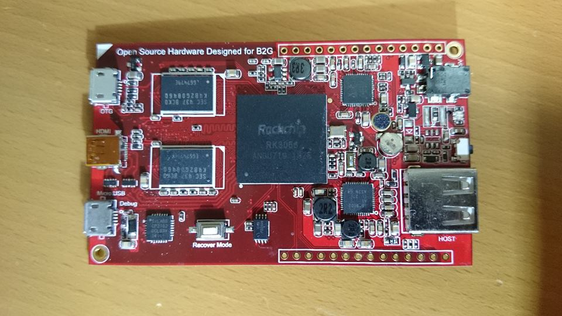

# CHIRIMEN

### Hardware Specs (Outline)
|  |  |
|:-----------|------------:
| SoC       | RK3066  |
| Memory     |  DDR3 1GB |
| Storage  |  NAND Flash 1GB , 1 microSD slot |
| Dimension | 80mm x 48 mm |
| Video |  microHDMI female |
| USB | microUSB x 1 (OTG) , USB x 1 , microUSB x 1 (UART debug) |
| GPIO | > 1 (Configurable)|
| I2C | 2 |
| UART | 2 |
| SPI | 2 |
| Audio | analog stereo IN x 1 / OUT x 1 |
| PWM | 1 |
| Analog | IN x 1 |
